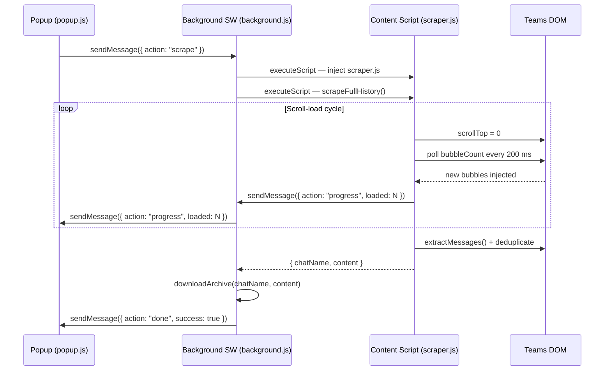

# Design Document: full-chat-history-export

## Overview

The full-chat-history-export feature extends the TeamsChat Archiver Chrome Extension to capture the
complete conversation history from a Microsoft Teams chat, not just the messages currently rendered
in the viewport. Teams uses a virtualized list — only a window of messages exists in the DOM at any
time. The extension must scroll the chat container to the top incrementally, wait for each batch of
older messages to load, deduplicate the collected records, and then produce the same
`{ chatName, content }` result shape that the existing download pipeline already handles.

The feature is implemented entirely inside `scraper.js` (a new `scrapeFullHistory()` entry point
plus a `scrollLoadHistory()` helper) and `background.js` (routing the popup's `scrape` action to
`scrapeFullHistory()` and relaying progress messages). The popup gains a live progress display but
its core structure is unchanged.

---

## Architecture



Key design decisions:

- **No new files** — all scroll-loading logic lives in `scraper.js` to keep the injection model
  simple (one `files` inject + one `func` call).
- **Progress via `chrome.runtime.sendMessage`** — the content script pushes updates; the background
  worker relays them to the popup. The popup registers a `chrome.runtime.onMessage` listener on
  load so it receives updates even if the popup is re-opened mid-run.
- **Backward compatibility** — `scrape()` is untouched; `scrapeFullHistory()` is the new entry
  point called by `background.js`.

---

## Components and Interfaces

### findChatContainer (scraper.js)

```js
/**
 * Locates the scrollable chat container element.
 * @returns {Element}
 * @throws {Error} "Chat container not found. Make sure a chat is open."
 */
function findChatContainer() { … }
```

Selector strategy (tried in order):
1. `[data-tid="chat-messages-list"]`
2. `[data-tid="message-pane"]`
3. `[role="list"]`
4. `[role="log"]`

### scrollLoadHistory (scraper.js)

```js
/**
 * @param {object}   opts
 * @param {number}   [opts.loadTimeout=3000]   ms to wait for new bubbles per scroll step
 * @param {number}   [opts.maxTotalMs=120000]  hard cap on total loading time
 * @param {number}   [opts.pollInterval=200]   ms between DOM polls
 * @param {function} [opts.onProgress]         callback(loadedCount) — called after each batch
 * @returns {Promise<{ timedOut: boolean, elapsedSeconds: number }>}
 */
async function scrollLoadHistory(opts = {}) { … }
```

Internal loop:
1. Locate `chatContainer` via `findChatContainer()`.
2. Record `startTime = Date.now()`.
3. Loop:
   a. `baseline` = current bubble count.
   b. `sentinel` = first child bubble element (for virtualiser stability).
   c. `chatContainer.scrollTop = 0`.
   d. Poll every `pollInterval` ms until count > baseline **or** `loadTimeout` elapsed.
   e. Count grew → call `opts.onProgress(newCount)`, continue.
   f. Count stable → break (history fully loaded).
   g. `Date.now() - startTime >= maxTotalMs` → `timedOut = true`, break.
4. Return `{ timedOut, elapsedSeconds }`.

### deduplicateRecords (scraper.js)

```js
/**
 * Removes duplicate MessageRecords using composite key sender+timestamp+content.
 * Retains the first occurrence in DOM order.
 * @param {MessageRecord[]} records
 * @returns {MessageRecord[]}
 */
function deduplicateRecords(records) { … }
```

### scrapeFullHistory (scraper.js) — new entry point

```js
/**
 * Full-history entry point. Runs ScrollLoader then Scraper.
 * Returns the same shape as scrape().
 * @returns {Promise<{ chatName: string, content: string }>}
 */
async function scrapeFullHistory() { … }
```

Steps:
1. Call `scrollLoadHistory({ onProgress })` where `onProgress` sends a progress message via
   `chrome.runtime.sendMessage({ action: "progress", loaded: N })`.
2. If `timedOut` and zero bubbles → throw error.
3. Call `extractChatName()` and `extractMessages()`.
4. Call `deduplicateRecords(records)`.
5. If `timedOut` → prepend warning line to content.
6. Return `{ chatName, content }`.

### background.js changes

- `handleScrapeRequest` calls `scrapeFullHistory()` instead of `scrape()`.
- Registers a `chrome.runtime.onMessage` listener for `{ action: "progress" }` messages from the
  content script and forwards them to the popup tab.
- Sends `{ action: "done", success: true }` (or `{ action: "done", error }`) to the popup after
  the download completes.

### popup.js changes

- Registers a `chrome.runtime.onMessage` listener on `DOMContentLoaded`.
- Updates `#status` text when `{ action: "progress", loaded: N }` is received.
- Handles `{ action: "done" }` to show final status and re-enable the button.

---

## Data Models

### MessageRecord (unchanged)

```ts
interface MessageRecord {
  sender:    string;   // display name
  timestamp: string;   // raw timestamp string, "" if absent
  content:   string;   // plain-text body
}
```

### ProgressMessage (new — content script → background → popup)

```ts
interface ProgressMessage {
  action: "progress";
  loaded: number;      // current Message_Bubble count
}
```

### DoneMessage (new — background → popup)

```ts
interface DoneMessage {
  action:   "done";
  success?: true;
  error?:   string;
}
```

### ScrollLoadResult (internal)

```ts
interface ScrollLoadResult {
  timedOut:       boolean;
  elapsedSeconds: number;
}
```

---

## Correctness Properties

*A property is a characteristic or behavior that should hold true across all valid executions of a
system — essentially, a formal statement about what the system should do. Properties serve as the
bridge between human-readable specifications and machine-verifiable correctness guarantees.*

### Property 1: Container detection — data-tid primary, ARIA fallback

*For any* DOM that contains a chat container element identifiable by either a `data-tid` attribute
or an ARIA role (`list` / `log`), `findChatContainer()` shall return that element without throwing.
When both selector tiers are present, the `data-tid` match shall be returned.

**Validates: Requirements 1.1, 1.2**

---

### Property 2: Container not found throws exact message

*For any* DOM that contains no element matching any known `data-tid` or ARIA role selector,
`findChatContainer()` shall throw an error whose message is exactly
`"Chat container not found. Make sure a chat is open."`.

**Validates: Requirements 1.3**

---

### Property 3: Scroll loop continues while new bubbles keep appearing

*For any* simulated chat container where each scroll step produces at least one new bubble for N
consecutive steps before stabilising, `scrollLoadHistory()` shall invoke the `onProgress` callback
exactly N times, each time with a strictly greater `loaded` value than the previous call.

**Validates: Requirements 2.1, 2.2, 2.3, 3.3**

---

### Property 4: Scroll loop exits when bubble count is stable

*For any* simulated chat container whose bubble count does not increase after a scroll action,
`scrollLoadHistory()` shall resolve (without throwing) within `loadTimeout + pollInterval`
milliseconds of that scroll action, with `timedOut: false`.

**Validates: Requirements 2.3, 3.4**

---

### Property 5: Progress callback receives strictly increasing counts

*For any* scroll-load run that produces K batches of new bubbles, the sequence of `loaded` values
passed to `onProgress` shall be strictly monotonically increasing (each value greater than the
previous).

**Validates: Requirements 5.2**

---

### Property 6: Timeout warning is prepended when loading times out with messages present

*For any* partial export triggered by a `maxTotalMs` timeout after at least one bubble has been
loaded, the first line of the returned `content` string shall match the pattern
`/^\[WARNING\] Chat history may be incomplete — loading timed out after \d+ seconds\./`.

**Validates: Requirements 6.2, 6.3**

---

### Property 7: Zero-bubble timeout throws instead of saving

*For any* run where `maxTotalMs` is exceeded before any bubble is loaded,
`scrapeFullHistory()` shall throw an error rather than returning a result object.

**Validates: Requirements 6.4**

---

### Property 8: Deduplication retains first occurrence and removes all duplicates

*For any* list of MessageRecords that contains entries sharing the same composite key
(sender + timestamp + content), `deduplicateRecords()` shall return a list where every composite
key appears exactly once and the retained record is the one that appeared earliest in the input.

**Validates: Requirements 7.1, 7.2**

---

### Property 9: Deduplication is idempotent

*For any* list of MessageRecords, applying `deduplicateRecords()` twice produces the same result
as applying it once: `deduplicateRecords(deduplicateRecords(records))` equals
`deduplicateRecords(records)`.

**Validates: Requirements 7.3**

---

### Property 10: scrapeFullHistory returns the same { chatName, content } shape as scrape

*For any* DOM that contains at least one valid message bubble, `scrapeFullHistory()` shall resolve
to an object with exactly the keys `chatName` (non-empty string) and `content` (string), matching
the shape returned by `scrape()`.

**Validates: Requirements 8.1, 8.4**

---

### Property 11: scrape() is unaffected by the new code

*For any* DOM state, calling `scrape()` shall return the same result regardless of whether
`scrapeFullHistory` and `scrollLoadHistory` are defined in the same module scope.

**Validates: Requirements 8.2**

---

## Error Handling

| Scenario | Behaviour |
|---|---|
| Chat container not found | `findChatContainer()` throws `"Chat container not found. Make sure a chat is open."` |
| No messages after full load | `extractMessages()` throws `"No messages found. Make sure a chat is open."` |
| Timeout with zero bubbles | `scrapeFullHistory()` throws (no file saved) |
| Timeout with ≥1 bubble | Warning line prepended; partial export saved |
| Sentinel removed by virtualiser | `console.warn(…)` logged; extraction continues with remaining DOM nodes |
| `chrome.runtime.sendMessage` fails during progress update | Error swallowed (best-effort); scroll loop continues uninterrupted |
| Popup closed mid-run | Content script continues; background completes download silently |

---

## Testing Strategy

### Dual Testing Approach

Both unit tests and property-based tests are required and complementary:

- **Unit tests** cover specific examples, integration points, and error conditions.
- **Property tests** verify universal invariants across randomly generated inputs.

Unit tests should focus on concrete scenarios (e.g., exact error messages, specific selector
matches, the zero-bubble timeout throw). Property tests handle broad input coverage.

### Unit Tests

- `findChatContainer` — returns element for each selector tier; throws correct message when none match.
- `scrollLoadHistory` — resolves after one stable step; calls `onProgress` with increasing counts;
  sets `timedOut: true` when `maxTotalMs` exceeded; default `loadTimeout` is 3000 ms.
- `deduplicateRecords` — removes exact duplicates; preserves insertion order; handles empty input.
- `scrapeFullHistory` — throws on zero-bubble timeout; prepends warning on partial timeout;
  returns `{ chatName, content }` on success.
- `background.js` — routes `scrape` action to `scrapeFullHistory()`; relays progress messages to
  popup tab; sends `done` message after download.

### Property-Based Tests

Uses **fast-check** (already a project dependency). Each property test runs a minimum of
**100 iterations**.

Tag format: `Feature: full-chat-history-export, Property {N}: {property_text}`

| Property | Test description |
|---|---|
| P1 | Generate DOMs with data-tid or ARIA containers → `findChatContainer` returns the right element |
| P2 | Generate DOMs with no matching selectors → `findChatContainer` always throws the exact error string |
| P3 | Simulate N growing steps → `onProgress` called N times with strictly increasing values |
| P4 | Simulate stable bubble count → loop resolves with `timedOut: false` within deadline |
| P5 | Simulate K batches → `onProgress` values are strictly monotonically increasing |
| P6 | Simulate timeout with ≥1 bubble → first line of content matches warning regex |
| P7 | Simulate timeout with 0 bubbles → `scrapeFullHistory` throws |
| P8 | Generate records with random duplicates → deduplicated list has unique keys, first occurrence retained |
| P9 | Generate any record list → `deduplicateRecords(deduplicateRecords(x))` equals `deduplicateRecords(x)` |
| P10 | Generate valid DOM → result has `chatName: string` and `content: string` |
| P11 | Generate any DOM → `scrape()` result is identical before and after `scrapeFullHistory` is defined |

Each correctness property must be implemented by a single property-based test referencing its
design property number in a comment.
