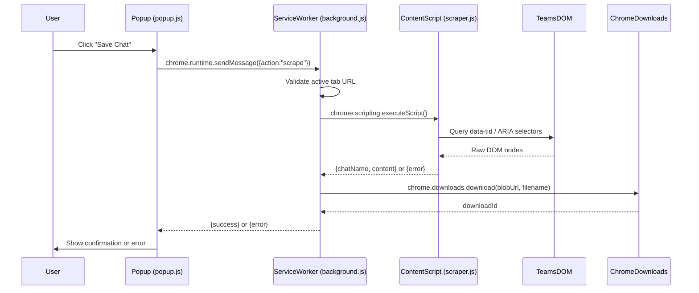

# Design Document: TeamsChat Archiver Chrome Extension

## Overview

TeamsChat Archiver is a Manifest V3 Chrome Extension that scrapes the visible chat thread from the Microsoft Teams web app (`teams.microsoft.com`) and saves it as a plain-text `.txt` file named after the active conversation. The extension requires no server-side component — all processing happens locally in the browser.

The core flow is:
1. User clicks the extension icon and presses "Save Chat" in the popup.
2. The popup sends a message to the background service worker.
3. The service worker validates the active tab and injects the content script via the `scripting` API.
4. The content script scrapes the DOM, formats messages, and returns the result.
5. The service worker triggers a file download via `chrome.downloads`.
6. The popup displays success or error feedback.

---

## Architecture

The extension follows the standard MV3 three-layer architecture:



### File Structure

```
teams-chat-archiver/
├── manifest.json          # MV3 manifest
├── background.js          # Service worker — orchestration & download
├── scraper.js             # Content script — DOM scraping & formatting
├── popup.html             # Extension popup markup
└── popup.js               # Popup UI logic
```

No build step is required. All files are plain JavaScript loaded directly by Chrome.

---

## Components and Interfaces

### manifest.json

Declares MV3 metadata, permissions, host permissions, background service worker, and browser action.

Key fields:
- `"manifest_version": 3`
- `"permissions": ["activeTab", "storage", "downloads", "scripting"]`
- `"host_permissions": ["https://teams.microsoft.com/*"]`
- `"background": { "service_worker": "background.js" }`
- `"action": { "default_popup": "popup.html" }`

The content script (`scraper.js`) is **not** declared in `content_scripts` — it is injected on demand via `chrome.scripting.executeScript` so it only runs when the user explicitly triggers it.

---

### background.js (Background Service Worker)

Responsibilities:
- Listen for `{action: "scrape"}` messages from the popup.
- Validate that the active tab URL matches `https://teams.microsoft.com/*`.
- Inject `scraper.js` into the active tab using `chrome.scripting.executeScript`.
- Receive the scraper result and trigger a download.
- Return `{success: true}` or `{error: string}` to the popup.

Key function signatures (conceptual):

```js
// Message listener entry point
chrome.runtime.onMessage.addListener((message, sender, sendResponse) => { ... })

// Validates tab URL, injects scraper, triggers download
async function handleScrapeRequest(sendResponse)

// Creates a UTF-8 Blob URL and calls chrome.downloads.download
async function downloadArchive(chatName, content)
```

Communication with popup uses `sendResponse` (synchronous callback pattern with `return true` to keep the message channel open for async response).

---

### scraper.js (Content Script)

Injected into the active Teams tab on demand. Runs synchronously and returns a result object.

Responsibilities:
- Extract the Chat_Name from the conversation header.
- Iterate message bubble elements.
- For each bubble: extract sender, timestamp, and text content.
- Handle consecutive messages (reuse last sender) and missing timestamps.
- Format all records and join with newlines.
- Return `{chatName, content}` on success or throw an error on failure.

Selector strategy (in priority order):
1. `data-tid` attribute selectors (e.g., `[data-tid="chat-pane-list"]`, `[data-tid="message-body"]`)
2. ARIA label/role selectors as fallback (e.g., `[aria-label]`, `[role="listitem"]`)
3. Never rely on CSS class names

Key function signatures (conceptual):

```js
// Entry point — called by executeScript, must return serializable value
function scrape()

function extractChatName()   // returns string
function extractMessages()   // returns MessageRecord[]
function formatRecord(record) // returns string
function sanitizeFilename(name) // returns string
```

---

### popup.html / popup.js (Popup UI)

A minimal HTML popup with:
- A "Save Chat" button (`#save-btn`)
- A status paragraph (`#status`)

`popup.js` responsibilities:
- Attach click handler to `#save-btn`.
- On click: disable button, show "Saving…" status, send `{action:"scrape"}` to background.
- On success response: show "Saved successfully."
- On error response: show the error message.
- Re-enable button after completion.

---

## Data Models

### MessageRecord

Represents a single extracted message before formatting.

```js
/**
 * @typedef {Object} MessageRecord
 * @property {string} sender    - Display name of the message sender
 * @property {string} timestamp - ISO-like timestamp string, or "" if unavailable
 * @property {string} content   - Plain-text message body (HTML stripped)
 */
```

### ScrapeResult (success)

```js
/**
 * @typedef {Object} ScrapeResult
 * @property {string} chatName  - Sanitized chat/conversation name
 * @property {string} content   - Full formatted archive text (newline-joined records)
 */
```

### ScrapeError

```js
/**
 * @typedef {Object} ScrapeError
 * @property {string} error - Human-readable error description
 */
```

### Formatted Line Examples

| Condition | Output |
|---|---|
| Timestamp present | `[2024-03-15 14:32] Alice: Hello there` |
| Timestamp missing | `[unknown] Alice: Hello there` |
| Consecutive message (same sender) | `[2024-03-15 14:33] Alice: Follow-up message` |

---


## Correctness Properties

*A property is a characteristic or behavior that should hold true across all valid executions of a system — essentially, a formal statement about what the system should do. Properties serve as the bridge between human-readable specifications and machine-verifiable correctness guarantees.*

### Property 1: Chat Name Sanitization

*For any* string used as a chat name, the sanitized result must not contain any characters that are invalid in file names (`/`, `\`, `:`, `*`, `?`, `"`, `<`, `>`, `|`), and all such characters must be replaced with underscores.

**Validates: Requirements 2.3**

---

### Property 2: Message Extraction Completeness and Sender Continuity

*For any* Teams chat DOM containing N message bubbles, the scraper must produce exactly N `MessageRecord` objects. For each record, the sender field must be non-empty — either extracted directly from that bubble's sender element, or carried forward from the most recent bubble that did have a sender.

**Validates: Requirements 3.1, 3.2, 3.5**

---

### Property 3: HTML Stripping

*For any* message bubble whose inner content contains HTML markup (tags, attributes, entities), the extracted `content` field of the resulting `MessageRecord` must contain no HTML tags (i.e., no substrings matching `<...>`).

**Validates: Requirements 3.4**

---

### Property 4: Message Formatting Pattern

*For any* `MessageRecord` with a non-empty timestamp that can be normalized to `YYYY-MM-DD HH:MM`, the formatted output line must match the pattern `[YYYY-MM-DD HH:MM] Sender: Message`. For any `MessageRecord` with an empty timestamp, the formatted line must match `[unknown] Sender: Message`.

**Validates: Requirements 4.1, 4.2, 4.3**

---

### Property 5: Output Order and Structure

*For any* list of `MessageRecord` objects in a given order, the final archive content string must list the formatted records in the same order they appear in the DOM, separated by exactly one newline character between consecutive records.

**Validates: Requirements 4.4, 4.5**

---

### Property 6: Non-Teams Tab Rejection

*For any* active tab whose URL does not match `https://teams.microsoft.com/*`, the background service worker must return a response containing an `error` field (not a `success` field) when a scrape request is received.

**Validates: Requirements 6.3**

---

### Property 7: Download Filename Pattern

*For any* sanitized chat name string, the filename passed to `chrome.downloads.download` must be exactly `{chatName}.txt` — the sanitized name followed by the `.txt` extension with no other modifications.

**Validates: Requirements 7.2**

---

### Property 8: DOM Resilience — ARIA Fallback

*For any* Teams chat DOM where `data-tid` attributes are absent but equivalent ARIA label or role attributes are present on the same elements, the scraper must still successfully extract the chat name and all message records without error.

**Validates: Requirements 2.1, 8.2**

---

## Error Handling

| Scenario | Handler | Response to Popup |
|---|---|---|
| Active tab is not `teams.microsoft.com` | `background.js` | `{error: "This extension only works on teams.microsoft.com"}` |
| `chrome.scripting.executeScript` throws | `background.js` (try/catch) | `{error: "Failed to run scraper: <message>"}` |
| No message bubbles found in DOM | `scraper.js` (throws) | `{error: "No messages found. Make sure a chat is open."}` |
| Chat name not found in DOM | `scraper.js` | Falls back to `"teams-chat"` — not an error |
| Timestamp not parseable | `scraper.js` | Uses `""` for timestamp field — formats as `[unknown]` |
| `chrome.downloads.download` fails | `background.js` | `{error: "Download failed: <message>"}` |

All errors from `background.js` are returned via `sendResponse({error: ...})`. The popup checks for the presence of the `error` key to decide which UI state to show.

---

## Testing Strategy

### Dual Testing Approach

Both unit tests and property-based tests are required. They are complementary:
- Unit tests catch concrete bugs in specific scenarios and integration points.
- Property-based tests verify universal correctness across the full input space.

### Unit Tests

Focus areas:
- Manifest validation (permissions, host_permissions, service_worker field)
- Popup button click triggers correct message to background
- Popup displays correct status text for success and error responses
- Background correctly calls `chrome.scripting.executeScript` on valid tab
- Background correctly calls `chrome.downloads.download` with expected arguments
- Scraper returns `"teams-chat"` fallback when no chat name element is found
- Scraper throws when no message bubbles are found (requirement 8.4)
- Download Blob is created with `type: "text/plain;charset=utf-8"`
- Download options do not set `conflictAction: "overwrite"` (requirement 7.4)

Recommended framework: **Jest** with `jest-chrome` for mocking Chrome extension APIs.

### Property-Based Tests

Each property from the Correctness Properties section must be implemented as a single property-based test with a minimum of **100 iterations**.

Recommended library: **fast-check** (TypeScript/JavaScript, well-maintained, works with Jest).

Each test must be tagged with a comment in this format:
`// Feature: teams-chat-archiver, Property <N>: <property_text>`

| Property | Test Description | fast-check Arbitraries |
|---|---|---|
| P1: Chat Name Sanitization | Generate arbitrary strings, verify sanitized output contains no invalid chars | `fc.string()` |
| P2: Message Extraction Completeness | Generate mock DOM with N bubbles (some without sender), verify N records with non-empty senders | `fc.array(fc.record({...}))` |
| P3: HTML Stripping | Generate strings with random HTML tags injected, verify extracted content has no tags | `fc.string()` + HTML injection |
| P4: Message Formatting Pattern | Generate valid MessageRecords (with and without timestamps), verify output matches pattern | `fc.record({sender, timestamp, content})` |
| P5: Output Order and Structure | Generate ordered list of records, verify output preserves order and uses `\n` separator | `fc.array(fc.record({...}))` |
| P6: Non-Teams Tab Rejection | Generate arbitrary URLs that don't match teams.microsoft.com, verify error response | `fc.webUrl()` filtered |
| P7: Download Filename Pattern | Generate arbitrary sanitized chat names, verify filename is `{name}.txt` | `fc.string()` (alphanumeric) |
| P8: DOM Resilience — ARIA Fallback | Generate mock DOM with ARIA attrs but no data-tid, verify successful extraction | Custom DOM builder |

**Property test configuration:**
- Minimum 100 runs per property (`fc.assert(fc.property(...), {numRuns: 100})`)
- Each property test maps to exactly one property in this document
- Property tests live alongside unit tests in a `__tests__/` directory

### Test File Layout

```
__tests__/
├── manifest.test.js        # Unit: manifest validation
├── sanitize.test.js        # Unit + P1: filename sanitization
├── scraper.test.js         # Unit + P2, P3, P4, P5, P8: scraper logic
├── background.test.js      # Unit + P6, P7: orchestration & download
└── popup.test.js           # Unit: popup UI behavior
```
